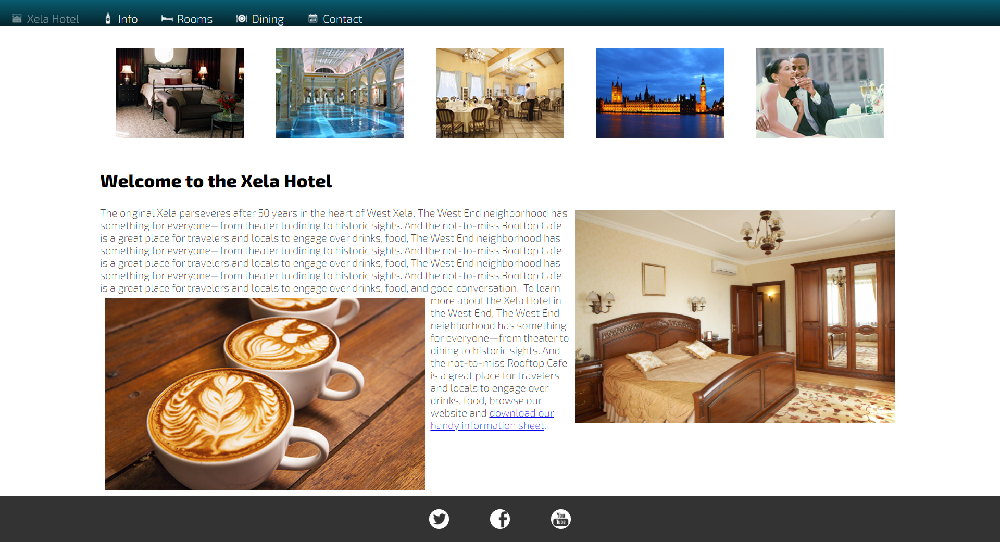
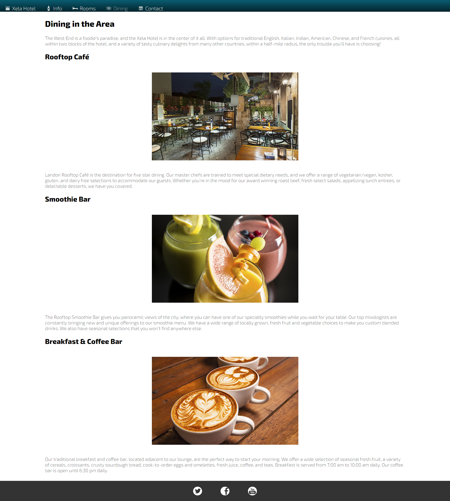
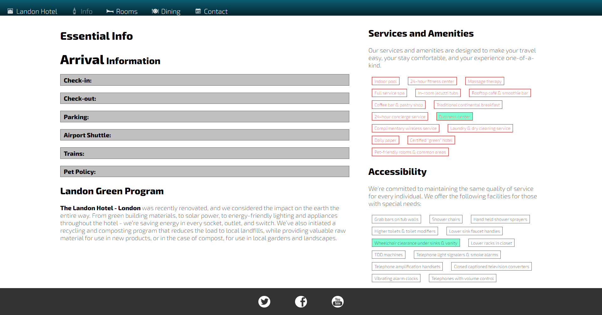
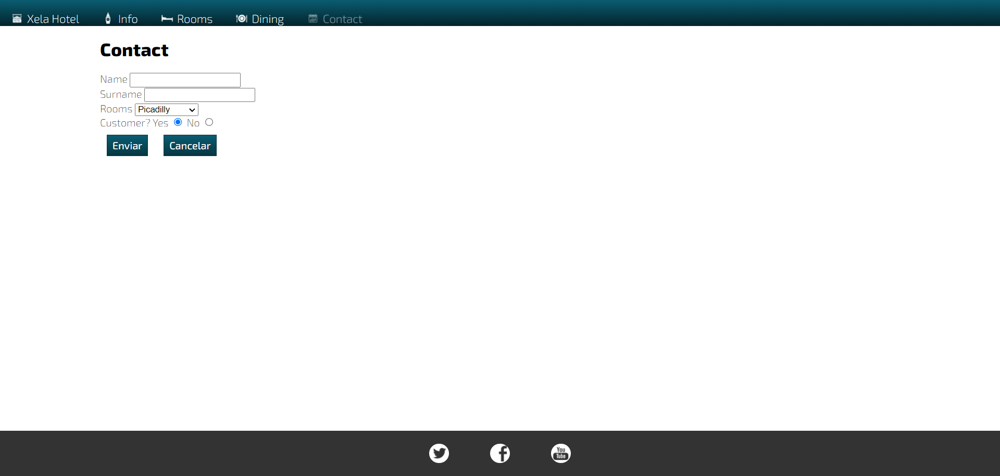

# Html-Css esencial (Práctica 1)

## Contexto del caso:
Xela hotel desea estar a la vanguardia de la tecnología, por ello ha iniciado con el desarrollo de su pagina web, en donde quiere mostrar sus comodidas, los dormitorios, variedad de gastronomia y demas servicos que ofrece.

Como desarrolladores de este proyecto, tú compañero de equipo ya ha estructurado la mayor parte de la pagina tal son los menus, los contenidos principales y demas recursos. 

Siguiendo con el Backlog de requerimientos se te pide:

- Ratificar la estructura de HTML: agregar, cambiar o eliminar etiquetas de las paginas.(aplique buenas prácticas).
- Desarrolle los estilos de vista del proyecto(CSS): aplique los conceptos css, y la metodologia BEM para su codificación. Guiarse en el prototipo acordado con el cliente.

### Entregable:
- Código legible del la práctica.
- En un archivo marckdown:
    - Enlazar las capturas de pantalla de las paginas.
    - Enlace de la publicación en github-pages(* puntos extras.)
    - Las dificultades que tuvo en la realización del proyecto( extra).

## Enlaces de apayo:

Documentación de HTML:
[HTML docs ](https://developer.mozilla.org/es/docs/Web/HTML)

Documentación de CSS:
[CSS docs](https://developer.mozilla.org/es/docs/Learn/CSS)

## prototipo:
### Home page:

### Dinning page:

### Info page:

### Rooms Page: 

### Contact page: 

# Html-Css-Practica1
